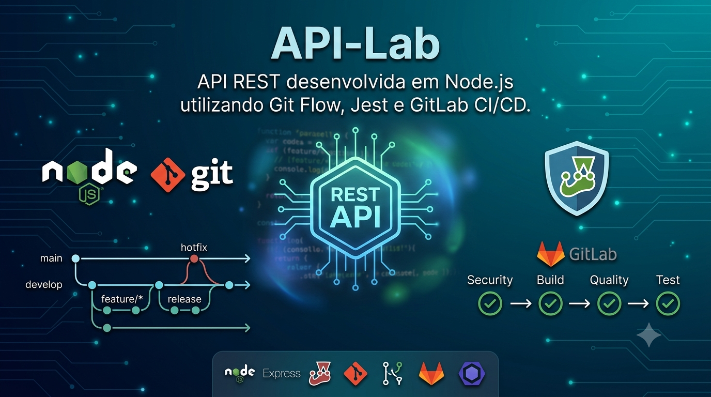
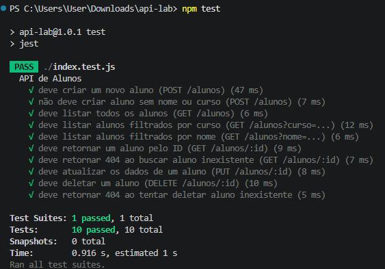
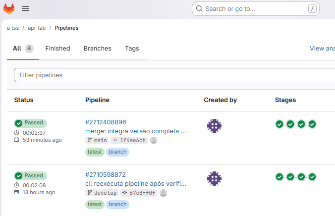

<p align="center">
  
</p>

<h1 align="center">API-Lab</h1>

<p align="center">
  API REST desenvolvida em <strong>Node.js</strong> utilizando <strong>Git Flow</strong>,
  <strong>Jest</strong> e <strong>GitLab CI/CD</strong>.
</p>

<p align="center">


</p>

---

# Sobre o Projeto

O **API-Lab** é uma API REST desenvolvida em **Node.js** como projeto prático da formação em DevOps.

O objetivo foi aplicar conceitos utilizados em ambientes profissionais, incluindo:

- Git Flow
- Versionamento distribuído
- Desenvolvimento de API REST
- Testes automatizados
- Integração Contínua (CI)
- Pipeline GitLab CI/CD
- Qualidade de código com ESLint

---

# Arquitetura

```text
Cliente
      │
      ▼
API REST (Express)
      │
      ▼
Dados em memória
```

---

# Tecnologias

| Tecnologia | Utilização |
|------------|------------|
| Node.js | Backend |
| Express | API REST |
| Jest | Testes automatizados |
| ESLint | Qualidade de código |
| Git | Versionamento |
| Git Flow | Estratégia de branches |
| GitLab CI/CD | Pipeline |
| GitHub | Portfólio |

---

# Estrutura do Projeto

```text
api-lab
│
├── index.js
├── index.test.js
├── package.json
├── package-lock.json
├── eslint.config.js
├── .gitignore
├── .gitlab-ci.yml
├── README.md
└── docs
    └── images
        ├── api-lab-banner.png
        ├── pipeline-passed.png
        └── testes-passed.png
```

---

# Git Flow

O desenvolvimento foi realizado utilizando Git Flow.

## Branches

```text
main

develop

feature/setup-inicial

feature/criar-aluno

feature/listar-alunos

feature/atualizar-aluno

feature/deletar-aluno

docs/readme
```

Cada funcionalidade foi implementada em sua própria branch e integrada posteriormente à branch **develop**.

---

# Funcionalidades

### Cadastro

- Criar aluno

### Consulta

- Listar todos os alunos
- Buscar aluno por ID
- Filtrar por nome
- Filtrar por curso

### Atualização

- Atualizar aluno

### Exclusão

- Remover aluno

---

# Testes Automatizados

Foram implementados testes utilizando **Jest** para validar todas as funcionalidades da API.

Os testes contemplam:

- Cadastro
- Validação de campos obrigatórios
- Consulta
- Filtros
- Atualização
- Exclusão
- Tratamento de registros inexistentes

Resultado obtido:

```text
Test Suites: 1 passed

Tests: 10 passed
```

<p align="center">

</p>

---

# Pipeline GitLab CI/CD

A Integração Contínua foi implementada utilizando GitLab CI.

### Estágios

```text
Security

Build

Quality

Test
```

### Jobs

- security-sast
- build
- lint-and-quality
- test

Resultado:

<p align="center">

</p>

---

# Como executar

## Instalar dependências

```bash
npm install
```

## Executar aplicação

```bash
node index.js
```

## Executar testes

```bash
npm test
```

## Executar ESLint

```bash
npm run lint
```

---

# Competências Desenvolvidas

- Desenvolvimento Backend
- API REST
- Node.js
- Express
- Git
- Git Flow
- GitLab CI/CD
- Testes Automatizados
- Integração Contínua
- Qualidade de Código

---


# Resultados do Projeto

- ✅ API REST funcional
- ✅ CRUD completo
- ✅ 10 testes automatizados aprovados
- ✅ Git Flow aplicado
- ✅ Pipeline GitLab CI/CD aprovada
- ✅ Versionamento com Git
- ✅ Projeto publicado no GitHub e GitLab
- ✅ Documentação técnica completa

---

# Próximas Evoluções

O projeto poderá evoluir para uma versão completa contendo:

- Frontend em React
- PostgreSQL
- Docker Compose
- Swagger/OpenAPI
- JWT Authentication
- Deploy em Cloud
- Dashboard Web

---

# Repositórios

### GitHub

Código-fonte e documentação do projeto.

### GitLab

Pipeline CI/CD e fluxo de Integração Contínua.

---

# Autora

**Alê Tavares**

- Engenharia de Software
- Tecnóloga em Segurança da Informação
- Residente em Cibersegurança
- Formação DevOps

---

## Licença

Projeto desenvolvido para fins acadêmicos, de estudo e composição de portfólio técnico.
